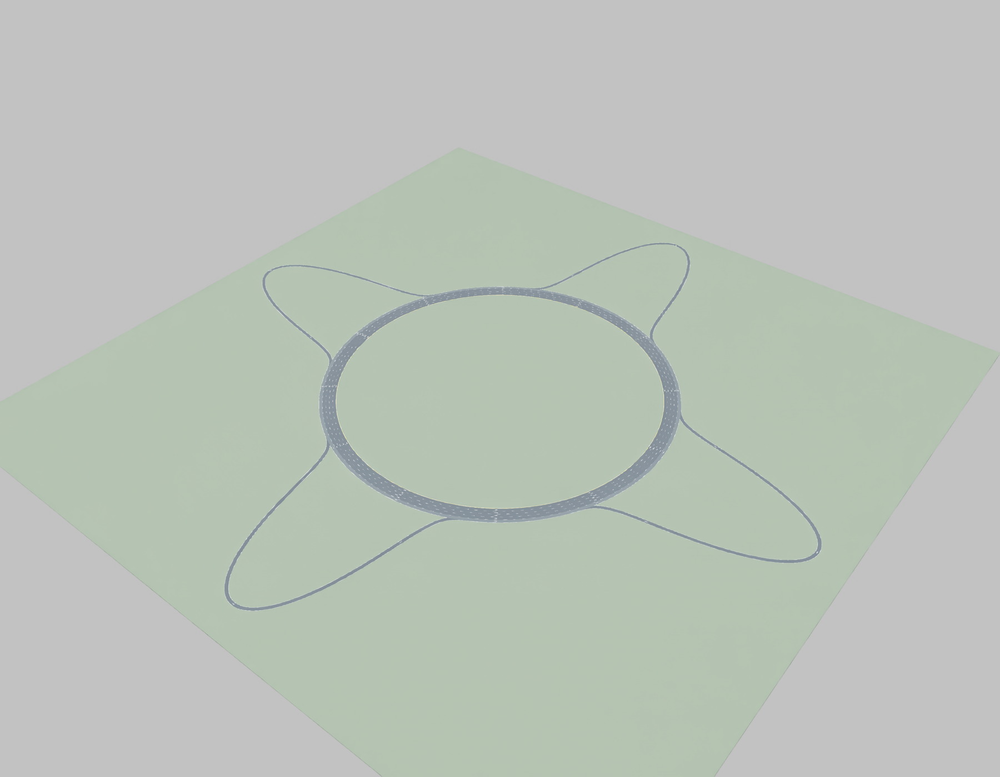
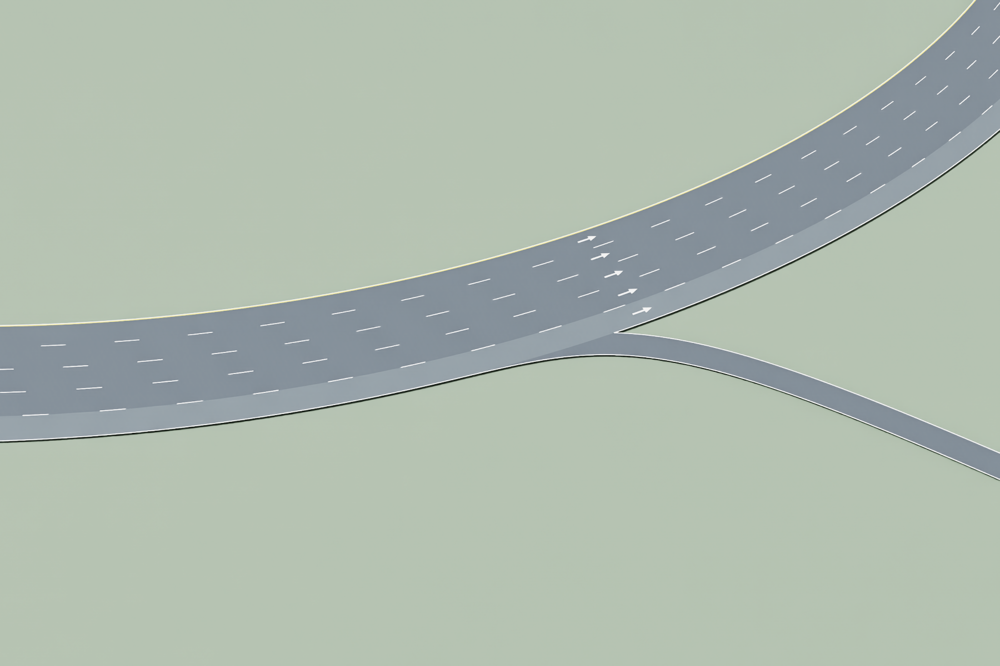

# Four-leaf highway USD — v01

`highway_v01.usda` is a static, Z-up OpenUSD road environment. It contains a four-lane circular highway, one outer auxiliary lane, and four same-level radial ramp petals. The ramps diverge from and rejoin the auxiliary loop; they are not grade-separated cloverleaf ramps.

## Coordinate frame and driving direction

- Units are meters, up is +Z, east is +X, and north is +Y.
- All circular lanes travel counterclockwise. At the east side, for example, a vehicle points north and the road's right-hand side is radially outward.
- Vehicle forward is +X in its local frame. The JSON waypoints are ordered in the direction of travel.
- Road centerlines and spawn transforms lie on the road surface at Z=0. Spawn points are surface anchors: add the vehicle-specific height offset before placing a vehicle, so its chassis does not start at the road datum.

## Stage contents

The default prim is `/World`. The authored hierarchy is:

```text
/World
  /RoadNetwork
    /CircularHighway/Surface       four main lanes as the circular paved band
    /AuxiliaryLane/Surface         continuous outer circular lane
    /Ramps/{East,North,West,South}/Surface
    /Markings                      pavement edges, inner yellow line, lane dashes, arrows
  /Navigation
    /Lanes/{MainLane1..4,AuxiliaryLane,RampEast..South}
    /Edges/{main,auxiliary-segment,and ramp edges}
  /SpawnPoints                     four cardinal-diagonal anchors on each of five loop lanes
  /DivergeZones/{East,North,West,South}
  /MergeZones/{East,North,West,South}
  /Physics
    /Scene
    /RoadCollider                  one static union collider for the complete paved footprint
  /Ground
  /Looks
  /Lighting
  /Cameras/Top
  /Debug
```

The circular highway has four 3.7 m lanes inside a continuous 3.7 m auxiliary lane. Each ramp uses a radial `sin⁴(πt)` extension from the auxiliary radius, over a ±32° angular span centered on its cardinal direction. It reaches at most 180 m beyond the auxiliary radius and smoothly returns to the downstream auxiliary lane. The single `/World/Physics/RoadCollider` is a closed, welded solid covering the combined footprint. Its collision approximation is `none`, preserving all five islands. The separate ground is an analytic box with its top at Z=-0.3 m. Road surfaces are triangulated after 1 mm snapping and conversion to USD's float32 coordinates, avoiding degenerate faces at boolean joins. Navigation retains the analytic sampled circle.

Navigation is data and USD guide geometry only. Lane and edge records describe widths, speed hints, neighbor links, successors, and merge/diverge references. The merge-zone policy explicitly leaves yielding and routing to a future controller. This asset has no vehicle controllers, traffic actors, SUMO wiring, or active route execution.

## Parameters and generated files

`parameters.json` records the resolved dimensions and hints. Defaults live in `Parameters` in the generator; supply `--parameters parameters.json` to regenerate from an edited parameter file:

| Parameter | v01 value |
| --- | ---: |
| Inner radius | 180 m |
| Main lanes | 4 × 3.7 m |
| Auxiliary lane | 3.7 m |
| Ramp extension | 180 m |
| Ramp half-angle | 32° |
| Circle / ramp samples | 1,440 / 1,024 |
| Road top / thickness | 0 / 0.3 m |
| Ground margin | 35 m |
| Main / auxiliary / ramp speed hints | 15 / 10 / 8 m/s |

The speed values are provisional metadata hints, not enforced limits. The main lane center radii are 181.85, 185.55, 189.25 and 192.95 m; the auxiliary radius is 196.65 m. Each ramp is about 495.74 m long with a minimum sampled turn radius of 23.37 m. `navigation.json` is the machine-readable network sidecar; `overview.png` is a navigation diagram, and `screenshots/` contains actual USD/RTX renders. `manifest.json` records library versions, parameters, and SHA-256 digests for the stage, navigation, parameters, and generator.

The graph has four self-repeating main-lane edges, eight auxiliary segments, and four ramp edges. At a diverge node the incoming auxiliary edge can continue on the auxiliary circle or take the ramp. Every ramp's successor is the downstream auxiliary segment. Lane-neighbor relationships permit an application to plan lane changes, but do not define lane-change trajectories. Auxiliary waypoint indices in zone metadata locate the exact shared endpoints. The ±15 m zone length is descriptive only; it is not a physical trigger volume or a traffic rule.

## Regenerate

Use a dedicated environment in this version folder. The authoring requirements are kept separate from Highway Sim's traffic and Isaac environments.

```powershell
Set-Location C:\Users\hudso\Documents\highwaysim\highway_usd\_v01
py -3.11 -m venv .venv
.\.venv\Scripts\python.exe -m pip install -r requirements-authoring.txt
.\.venv\Scripts\python.exe .\generate_highway.py --output .
```

`requirements-authoring.txt` pins the offline authoring dependencies. The `.venv` is local and ignored by Git. Preserve `_v01` when beginning `_v02`: copy the source scripts, dependency file, and documentation, not the virtual environment. This generator and validator deliberately identify v01; update their stage filenames, version labels and preview title in the new version before generating. An output-directory change alone does not rename the asset version.

## Validation status and next checks

**Static asset validation passed.** `validation_report.json` records 108 prims, 129 valid relationship targets, nine lane paths, sixteen route edges, and twenty spawn anchors. All 28 installed USD validators passed with no errors or warnings. Every ramp reconnects with zero endpoint gap; sampled join heading error is at most 0.0313°. The auxiliary/ramp graph is strongly connected and every main lane is closed. The collision mesh is watertight, has upward top faces, and covers all centerlines. Three deliberately corrupted fixtures (dead end, disconnected merge and missing collider) were correctly rejected. Regeneration is byte-identical for the USDA, navigation and parameter files.

**Contact checks passed; the overall Isaac smoke gate remains failed.** Two retained runs dropped 26 spheres for 360 steps at 120 Hz onto the main/aux lanes, ramps, all joins and ground. Every final height and horizontal-drift check passed. Run 02 uses the final box ground and removed run 01's large-triangle cooking warning. Isaac still reports an unexpected stage reference count during close, the same warning class tracked in the project's physics-lifecycle work; its owner remains unresolved. Fabric/renderer warnings also remain in the logs. This is a static geometry draft, not a clean runtime lifecycle or vehicle-driving acceptance. See `physics_smoke_report.json` and the unique evidence directories it lists.

Run these from the version folder. The smoke supervisor launches the existing Isaac runtime in a hidden child process, enforces a 180-second deadline, and requires a fresh evidence directory:

```powershell
.\.venv\Scripts\python.exe .\validate_highway.py
.\.venv\Scripts\python.exe .\test_validation.py
$smokeOutput = 'C:\Users\hudso\Documents\highwaysim\outputs\highway_usd\v01-smoke-new-run'
.\.venv\Scripts\python.exe .\smoke_highway.py --output $smokeOutput
```

Do not install authoring packages into Isaac's Python. No training was launched and no existing scene or traffic controller was changed. The version-level smoke report is a compact evidence summary; bulk runtime logs stay in project `outputs/` and are not committed.

## Screenshots for every version

`screenshots/top.png`, `screenshots/angled.png`, and `screenshots/east_diverge.png` document the actual rendered USD. `screenshots/screenshots.json` records camera poses, resolution, renderer versions, image hashes and the source-stage hash. `capture_views.usda` is a separate view layer; it hides guide geometry and leaves the environment file unchanged.

Capture the same three views after generating and validating each new `_vNN`. Run the capture script using the project's existing isolated ovrtx environment, passing that version's source file and screenshot folder:

```powershell
..\..\.venv-ovrtx\Scripts\python.exe .\capture_screenshots.py --scene .\highway_v01.usda --output .\screenshots
```

Screenshots verify the saved visual state, not simulation behavior. The top-down navigation diagram remains useful alongside them because it labels the exits and merges.






## Limits

V1 is flat, unbanked and visually simple: no shoulders, barriers, elevation separation, vehicle assets, sensors, traffic manager or SUMO network. Paved boundaries are polygonal approximations of the analytic centerlines. Mesh snapping produces a measured 0.00994 m² aggregate render/collision footprint difference, concentrated at sub-millimeter boundaries. Speed hints and generic friction (0.9 static / 0.8 dynamic) need vehicle-specific testing. All prim groups live beneath `/World` so the complete asset is referenceable as one default prim.

Schema references: [OpenUSD physics](https://openusd.org/release/api/usd_physics_page_front.html), [linear/periodic navigation curves](https://openusd.org/dev/api/class_usd_geom_basis_curves.html).

## v02 priorities

1. Check ramp curvature and usable speeds with the physical vehicle.
2. Add a lane-change and yield-routing adapter over the navigation metadata.
3. Extend acceleration and deceleration zones and add realistic shoulders.
4. Integrate this map with the shared project road network.
5. Resolve the runtime lifecycle/Fabric warnings before claiming a clean simulator gate, and retain the same three screenshots for `_v02`.
