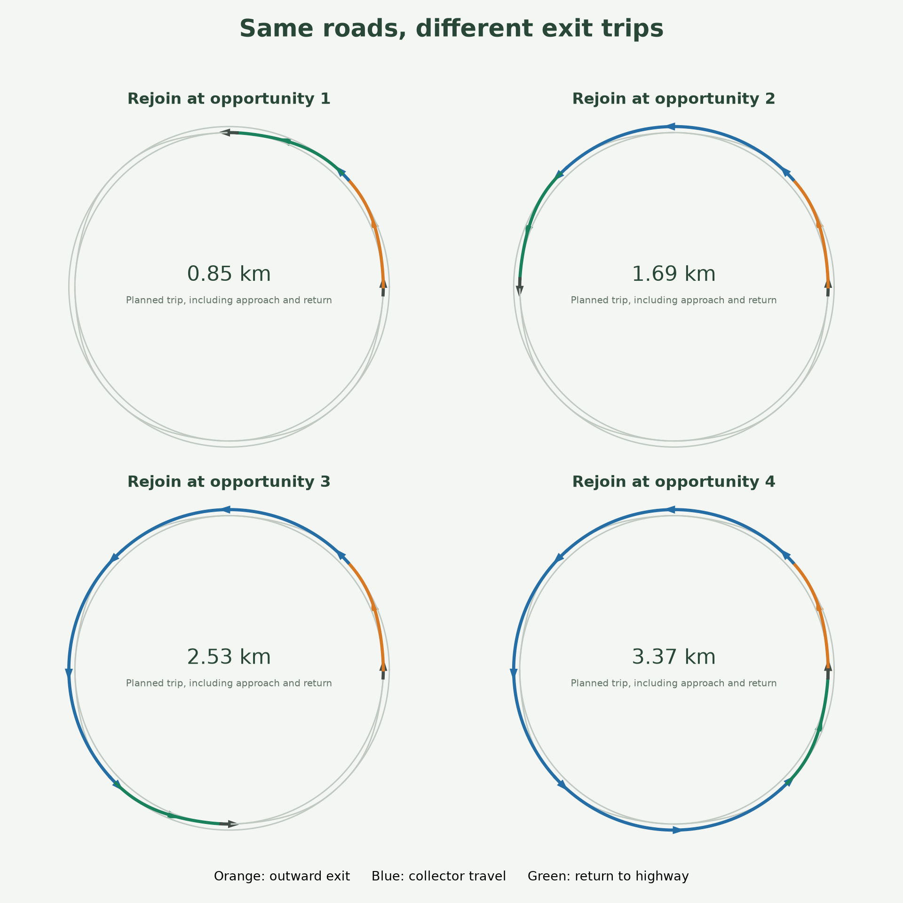

# Four-leaf highway USD — v02

`highway_v02.usda` is a static, Z-up OpenUSD road environment with a larger four-lane circular highway, an outer auxiliary lane, a separated outer collector, and eight smooth, same-level connectors. The four outbound exits lead from the auxiliary ring to the collector; four return links lead back. Rings and connectors are one-way counterclockwise. This is fixed road geometry with a seeded route planner; route choices do not create or move road geometry.

## Coordinate frame and road layout

- Units are meters, up is +Z, east is +X, north is +Y, and vehicle forward is +X in its local frame.
- Every ring travels counterclockwise. At the east side, a vehicle faces north; the road on its right is radially outward.
- The inner road boundary radius is 498.15 m. MainLane1 has a 500 m centerline radius; the four main lane centerlines are 500, 503.7, 507.4, and 511.1 m. The auxiliary lane centerline is 514.8 m.
- The collector centerline radius is 535 m with a 3.7 m lane width. Its inner paved edge is 16.5 m beyond the outer edge of the auxiliary pavement, leaving the ring bands separated except at the connectors.
- Exit connectors are right-side exits from the auxiliary lane to the collector. Return connectors leave the collector on its left side and rejoin the auxiliary lane. They occupy alternating 45° sectors, span 42°, and do not cross one another.
- Connector radius follows a quintic smootherstep between the two ring radii. The endpoints match each ring's tangent and curvature. The independent analytic check reports the same minimum radius for exits and returns: 379.386 m. At 65 mph, the theoretical unbanked lateral load is 0.2269g, under the configured 0.25g design bound. This geometric calculation does not establish a safe operating speed or vehicle handling performance.
- Road centerlines and spawn transforms are on the surface at Z=0. Spawn points are surface anchors; apply a vehicle-specific height offset before placing a vehicle.

## USD hierarchy

The default prim is `/World`:

```text
/World
  /RoadNetwork
    /CircularHighway/Surface
    /AuxiliaryLane/Surface
    /OuterCollector/Surface
    /Ramps/{East,North,West,South}/{Exit,Return}/Surface
    /Markings/{Edges,InnerYellow,LaneDividers,Arrows}
  /Navigation
    /Lanes/{MainLane1..4,AuxiliaryLane,CollectorLane,East..South Exit/Return}
    /Edges/{ring segments,exit links,return links,main-lane loops}
  /SpawnPoints                  24 surface anchors
  /DivergeZones                 8 junction metadata prims
  /MergeZones                   8 junction metadata prims
  /Physics/{Scene,RoadCollider}
  /Ground                       separate static ground collider
  /Looks
  /Lighting/{Sun,Sky}
  /Cameras/Top
  /Debug
```

The road and collector are static meshes. `/World/Physics/RoadCollider` is one watertight union mesh for the complete paved footprint; `/World/Ground` is a separate collider. The USD has no vehicle bodies or controllers. Lane and edge curves under `/World/Navigation` are guide geometry; node positions and zone metadata identify the graph connections. These describe the network and do not control traffic.

## Seeded route plans

`route_policy.py` writes route plans to JSON. A plan starts on an auxiliary segment approaching a chosen exit. It either remains on the auxiliary ring or takes one exit, travels counterclockwise around the collector, and returns at one of the next one to four reentry opportunities. Every selected return reconnects to the auxiliary ring within one collector lap. The seed makes the generated choices repeatable; the checked-in `route_examples.json` uses seed `20261006`, 24 vehicles, and exit probability `0.65`.

The policy selects routes only. Its requested speeds and release delays do not command vehicles or provide traffic safety. It does not implement lane changes, yielding, merge priority, collision avoidance, or dynamic road changes.

`route_variants.png` illustrates the four return opportunities from the same exit. Run `plot_routes.py` in the authoring environment to recreate it; its selected seed-65 plans are recorded in `route_variants.json`.



```powershell
$project = 'C:\Users\hudso\Documents\highwaysim'
$python = Join-Path $project 'highway_usd\_v01\.venv\Scripts\python.exe'
Set-Location (Join-Path $project 'highway_usd\_v02')
& $python .\route_policy.py --output (Join-Path $project 'outputs\highway_usd\v02-routes.json') --seed 20261006 --vehicles 24 --exit-probability 0.65
```

## Parameters and reproducibility

`parameters.json` records the 498.15 m inner boundary, 535 m collector centerline radius, 3.7 m lane width, 42° connector span, sample counts, 65 mph target speed, and 0.25g design bound. `navigation.json` stores the lane, node, edge, and successor graph. `manifest.json` records the OpenUSD and Shapely versions and SHA-256 hashes for the generated stage and authoring sources.

Use an isolated authoring environment; do not install these dependencies into Isaac Sim's Python. To reproduce a version in its own working copy:

```powershell
py -3.11 -m venv .venv
.\.venv\Scripts\python.exe -m pip install -r .\requirements-authoring.txt
.\.venv\Scripts\python.exe .\generate_highway.py --output .
.\.venv\Scripts\python.exe .\validate_highway.py
```

The v02 generator writes `highway_v02.usda` and `_v02` metadata. For a later version, copy the source and documentation into a new `_vNN` directory (omit local virtual environments), update the version-specific filenames and labels in that copy, and generate and validate there. Keep `_v01` and `_v02` unchanged as version records. V01 preservation hashes are recorded in `v01_preservation.json`; they describe the local files at the start of this iteration.

The saved structural validation passed with 28 USD validators, 14 lanes, 28 directed edges, 24 spawns, and 1,280 seeded route plans checked across all four return opportunities. It also checked connector curvature and lateral-load estimates, route connectivity, non-crossing geometry, mesh closure, and visual/collider agreement. This does not validate vehicle handling or traffic control.

## Contact smoke and screenshots

The latest bounded smoke produced passing contact assertions for all 47 temporary sphere drops across the main lanes, auxiliary lane, collector, connectors, junctions, and ground. The overall smoke supervisor marked the run failed because Isaac emitted an `Unexpected reference count` warning while closing the stage. The stage hash was unchanged and the process did not time out. Treat the smoke acceptance as unresolved until a clean run passes the warning gate. Even a clean pass establishes static contact only; it does not test a moving car, tires, merging, yielding, or traffic flow. Evidence is in `outputs/highway_usd/v02-smoke-20261006-01`.

Three rendered screenshots have been captured for this version: [top](screenshots/top.png), [angled](screenshots/angled.png), and [east diverge](screenshots/east_diverge.png). `screenshots/screenshots.json` records the view settings, runtime versions, and image hashes. The capture rendered the saved static stage and did not run a simulation.

```powershell
$project = 'C:\Users\hudso\Documents\highwaysim'
Set-Location (Join-Path $project 'highway_usd\_v02')
& (Join-Path $project '.venv-ovrtx\Scripts\python.exe') .\capture_screenshots.py --scene .\highway_v02.usda --output .\screenshots
```

Run the bounded contact smoke in a separate Isaac process and choose a new output directory under the project `outputs` folder for each run:

```powershell
$project = 'C:\Users\hudso\Documents\highwaysim'
Set-Location (Join-Path $project 'highway_usd\_v02')
$smokeOutput = Join-Path $project 'outputs\highway_usd\v02-smoke-20261006-02'
& (Join-Path $project 'highway_usd\_v01\.venv\Scripts\python.exe') .\smoke_highway.py --output $smokeOutput
```

## Next version

The next version needs moving-vehicle validation and actual handling checks, then explicit lane-change and yield/merge handling for traffic using the collector. The 65 mph figure is only a geometric curvature bound; it is not a proven safe vehicle speed.
